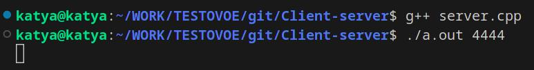
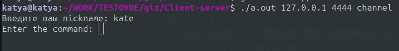
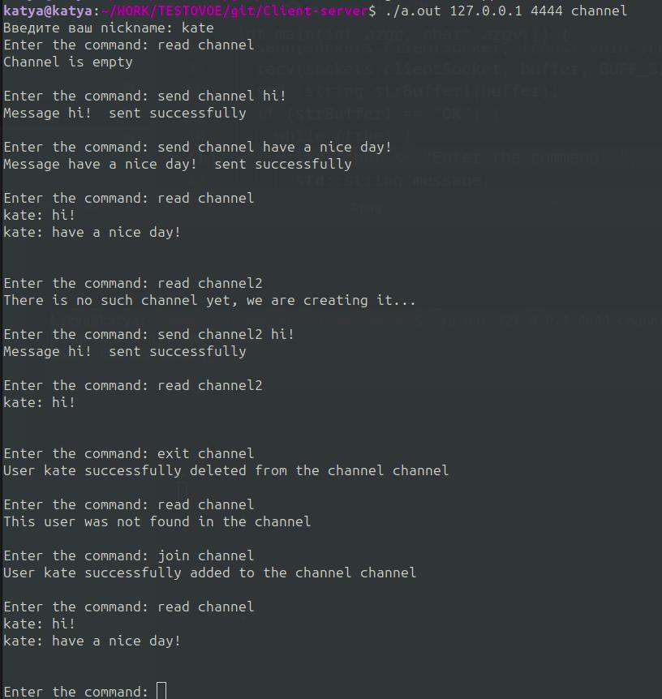
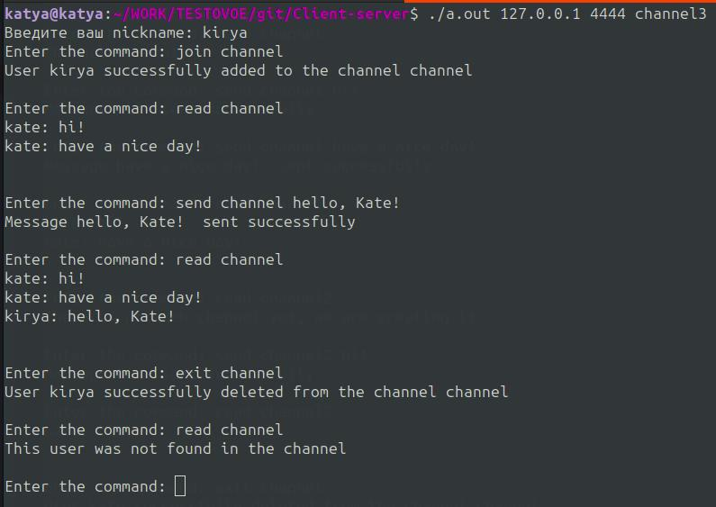
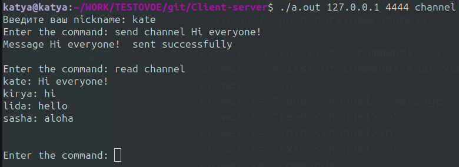
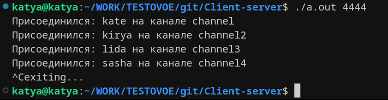

# Клиент-серверное приложение - мессенджер
## Описание: 
### Клиент-серверное приложение, поддерживающее подключение нескольких клиентов:
* позволяет подключаться клиентам по ip-адресу и порту
* создает личный канал при подключении пользователя с оригинальным никнеймом
* позволяет создавать новые каналы и подключаться уже к имеющимся
* позволяет писать в каналы и читать последние 40 сообщений выбранного канала
* позволяет выходить из указанного канала
### Пример работы:
#### Запуск сервера:

#### Создание пользователя:

#### Команды от пользователя:

#### Подлкючение n-ого пользователя:

#### Чат 4-х пользователей:

#### Выключение сервера:

